# ☁️ AWS Infrastructure Automation with Terraform

  

A modular Infrastructure-as-Code (IaC) project that automates the provisioning of a secure, scalable web server environment on AWS. This project demonstrates the use of **Terraform Modules** to organize resources logically into networking, security, and compute components.

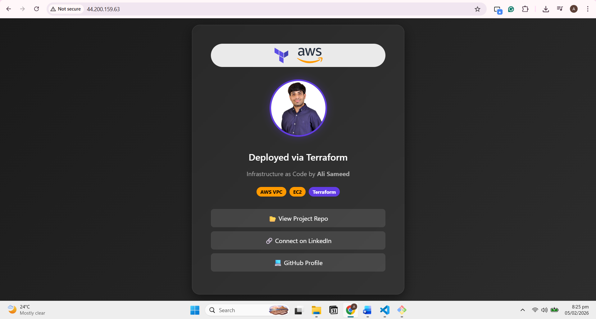

---

## 🏗️ Architecture

This project deploys a custom **Virtual Private Cloud (VPC)** with a public subnet, internet gateway, and a secured EC2 instance acting as a web server.

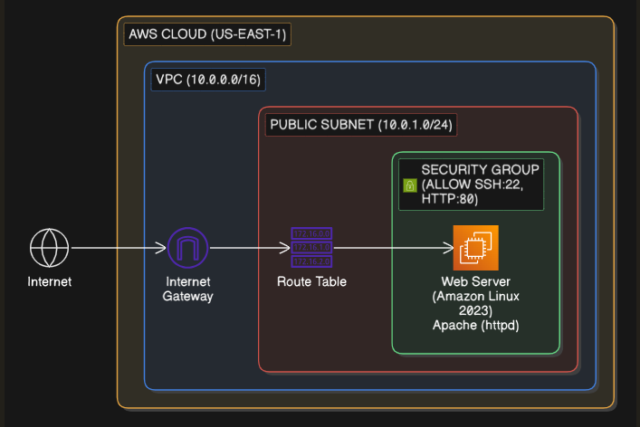

### Key Resources Created:
1.  **VPC:** Custom network (`10.0.0.0/16`) to isolate resources.
2.  **Public Subnet:** A specific zone (`10.0.1.0/24`) for web-facing resources.
3.  **Internet Gateway:** Enables connectivity between the instance and the internet.
4.  **Route Table:** Configures traffic routing for the public subnet.
5.  **Security Group:** Acts as a virtual firewall allowing:
    * `SSH (22)`: Restricted to my personal IP address for security.
    * `HTTP (80)`: Open to the world for web traffic.
6.  **EC2 Instance:** An Amazon Linux 2023 server running an Apache Web Server.

---

## 📂 Project Structure

The project follows a modular directory structure for reusability and maintainability.

```bash

├── main.tf                 # Root configuration calling 
├── variables.tf            # Global variables
├── outputs.tf              # Outputs (e.g., EC2 Public 
└── modules/
    ├── vpc/                # Networking module (VPC, 
    ├── security_groups/    # Firewall module
    └── ec2/                # Compute module
```   

## 📸 Detailed Execution Log

Here is the step-by-step visual documentation of the entire project lifecycle, from setup to destruction.

<details>
<summary><strong>👇 Phase 1: Environment Setup (IAM, CLI, Git)</strong></summary>

**1. AWS CLI Installation & Version Check**

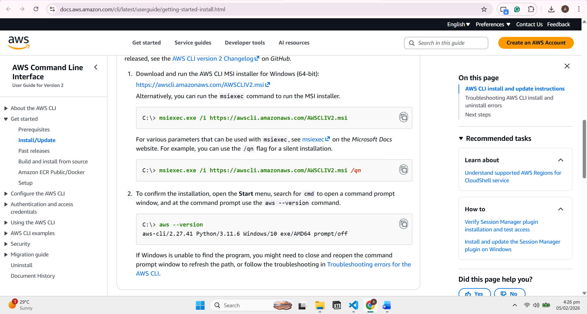

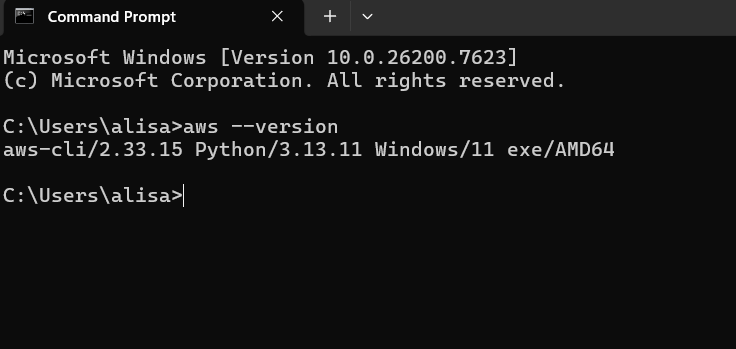

**2. IAM User Creation (Console)**
Creating the `terraform-user` with programmatic access.

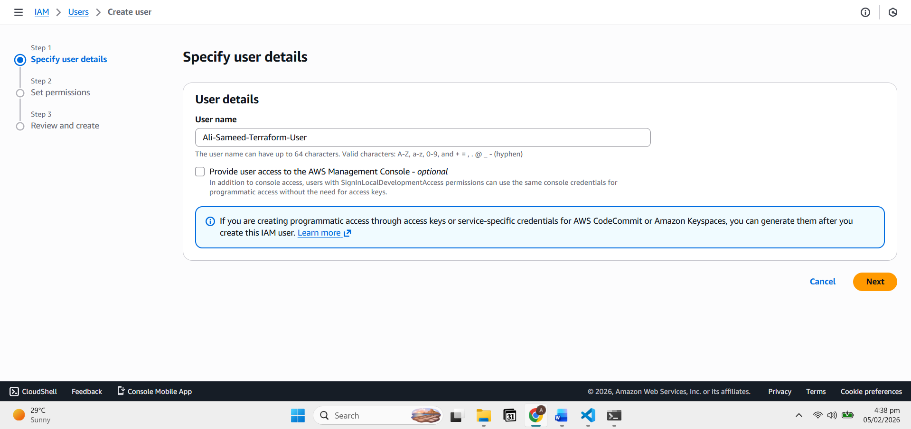

**3. Permissions Attachment**
Granting AdministratorAccess for Terraform.

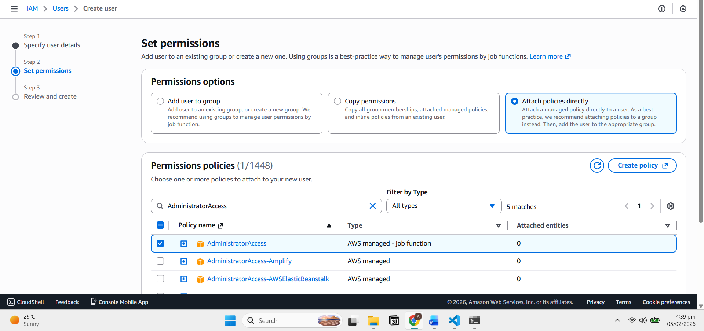

**4. Access Key Generation**
Generating the Access Key ID and Secret Access Key.

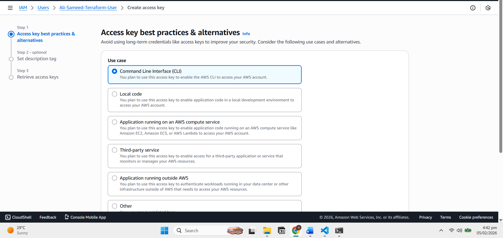

**5. AWS CLI Configuration**
Configuring local credentials with `aws configure`.

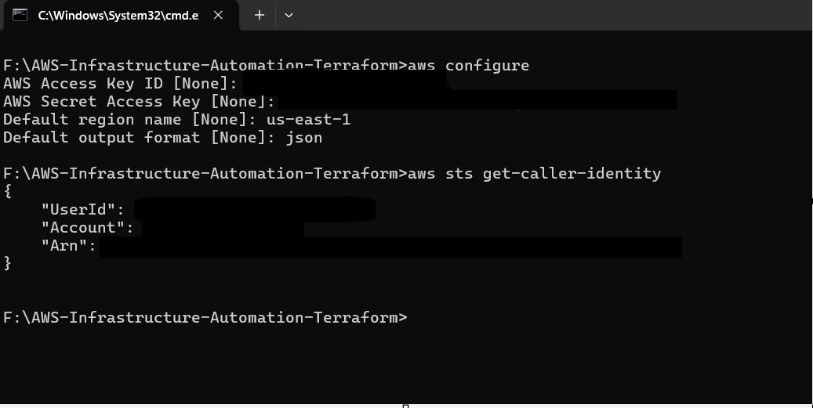

</details>

<details>
<summary><strong>👇 Phase 2: Terraform Initialization & Planning</strong></summary>

**1. Terraform Init**
Initializing the backend and downloading AWS providers.

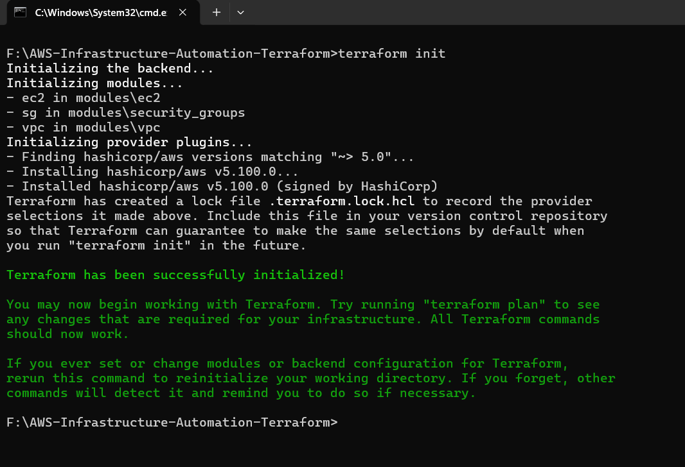

**2. Terraform Plan**
Previewing the creation of 11 resources (VPC, IGW, Subnets, EC2, SG).

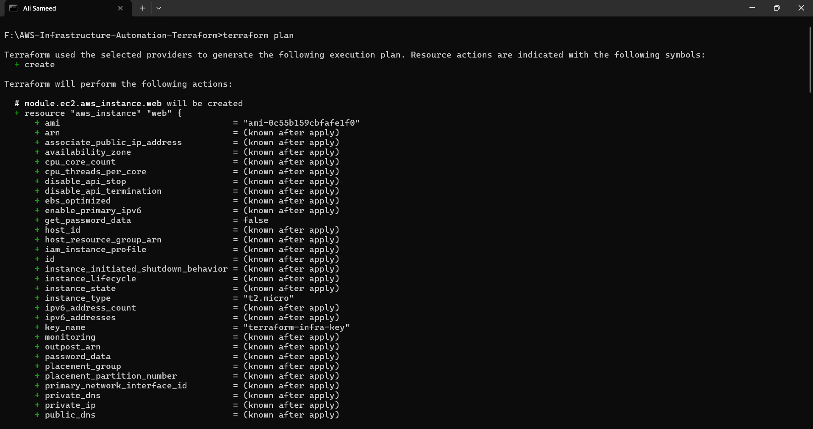

</details>

<details>
<summary><strong>👇 Phase 3: Deployment (Apply & Console Verification)</strong></summary>

**1. Terraform Apply**
Successfully provisioning infrastructure (Output: Public IP).

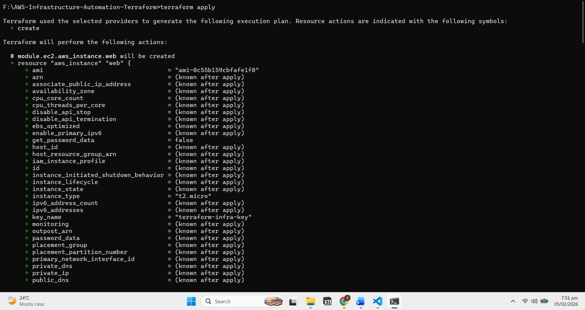

**2. AWS Console: EC2 Instance**
Verifying the instance is in the "Running" state.

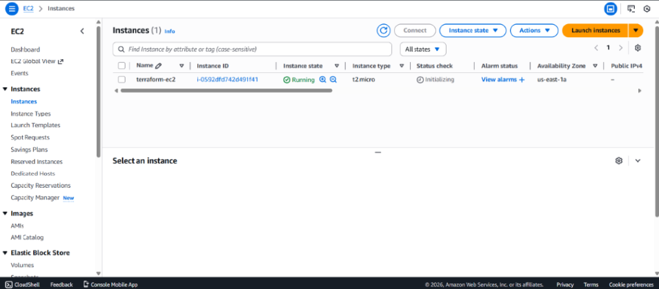

**3. AWS Console: Security Groups**
Confirming Port 22 (My IP) and Port 80 (Anywhere) are open.

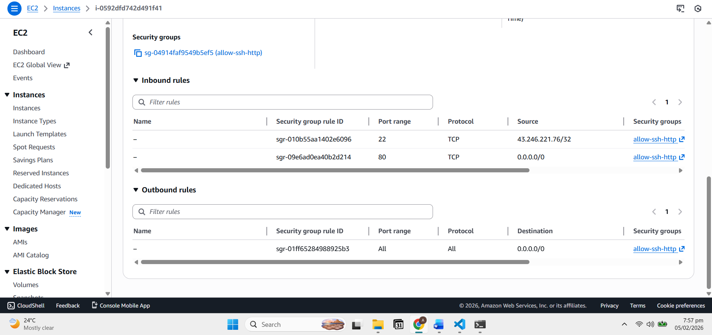

**4. AWS Console: VPC & Subnets**
Verifying the custom VPC and Public Subnet creation.


</details>

<details>
<summary><strong>👇 Phase 4: Server Configuration (SSH & Web Server)</strong></summary>

**1. SSH Login**
Connecting to the instance using the `.pem` key.

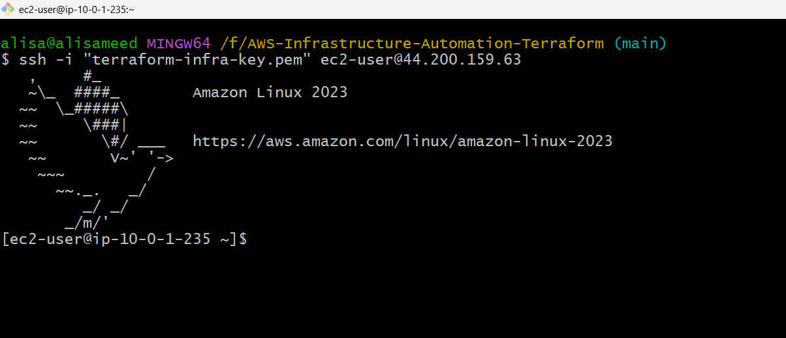

**2. Network Connectivity Test**
Pinging Google to verify the Internet Gateway works.

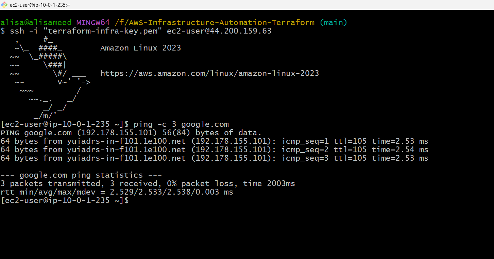

**3. Apache Installation**
Running `yum update` and `yum install httpd`.

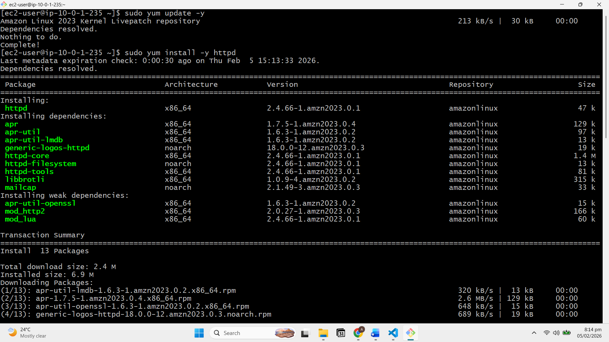

**4. Custom HTML Page**
Creating the portfolio landing page with Nano.

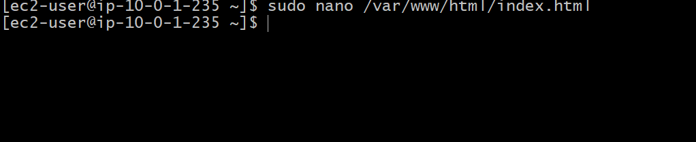

**5. Live Website**
Accessing the server via Public IP.


</details>

<details>
<summary><strong>👇 Phase 5: Teardown (Destroy)</strong></summary>

**1. Terraform Destroy**
Cleaning up all resources to prevent costs.

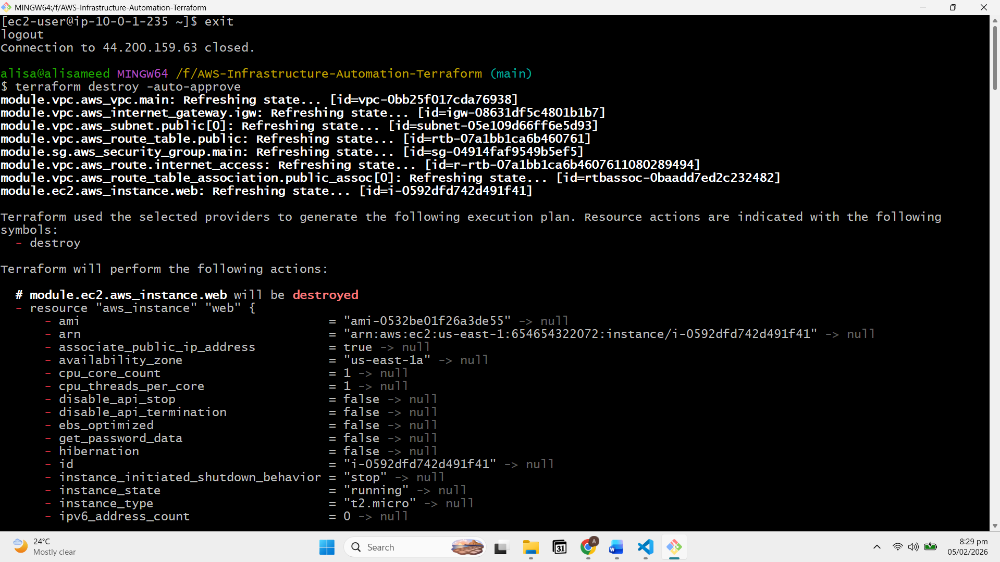

</details>

## 🚀 Getting Started

### Prerequisites

- AWS CLI installed and configured with your credentials.
- Terraform installed.
- An AWS Key Pair created in the us-east-1 region (e.g., terraform-infra-key).

### Step 1: Clone the Repository

```Bash
git clone https://github.com/alisameed32/AWS-Infrastructure-Automation-Terraform.git
cd AWS-Infrastructure-Automation-Terraform
```

### Step 2: Configure Variables
Create a terraform.tfvars file to define your specific configuration (this file is git-ignored for security).

```Terraform
region         = "us-east-1"
vpc_cidr       = "10.0.0.0/16"
public_subnets = ["10.0.1.0/24"]
azs            = ["us-east-1a"]
my_ip          = "YOUR_IP_ADDRESS/32"  # Go to whatismyip.com to find this
ami_id         = "ami-04b70fa74e45c3917" # Update with latest Amazon Linux AMI
instance_type  = "t2.micro"
key_name       = "terraform-infra-key"
```

### Step 3: Initialize Terraform
Downloads the required AWS providers and initializes the modules.

```Bash
terraform init
```


### Step 4: Plan the Deployment
Preview the 11 resources that Terraform will create.

```Bash
terraform plan
```


### Step 5: Apply Infrastructure
Provision the resources on AWS.

```Bash
terraform apply 
```


## 💻 Proof of Deployment

### 1. SSH Access
Verifying secure access to the server using the private key.


### 2. Web Server Configuration
The server was configured with Apache (httpd) and a custom HTML landing page.


### 3. Live Web Page
Accessing the server via its Public IP to view the deployed application.


## 🧹 Cleanup
To avoid AWS charges, destroy the infrastructure when finished:

```Bash
terraform destroy 
```


## 👤 Author

**Ali Sameed**

* **Role:** Cloud & DevOps Engineer
* **GitHub:** [github.com/alisameed32](https://github.com/alisameed32)
* **LinkedIn:** [linkedin.com/in/alisameed](https://www.linkedin.com/in/alisameed/)

---
*Built with ❤️ using Terraform and AWS.*